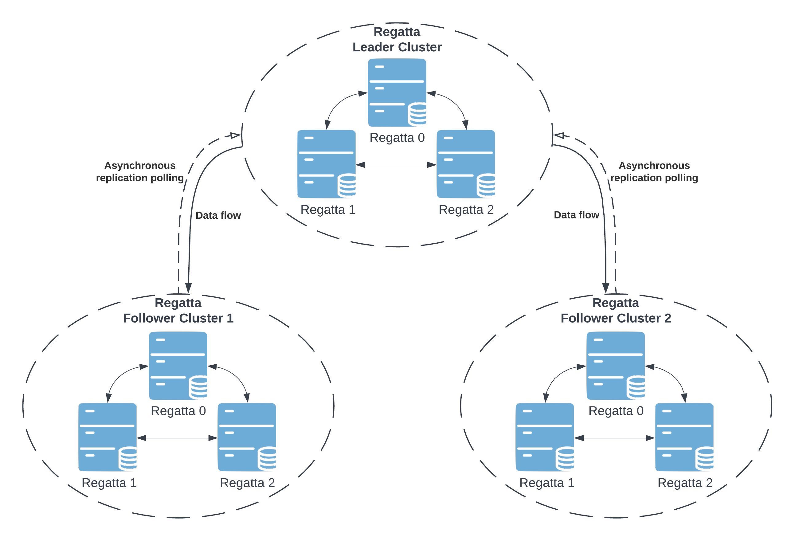
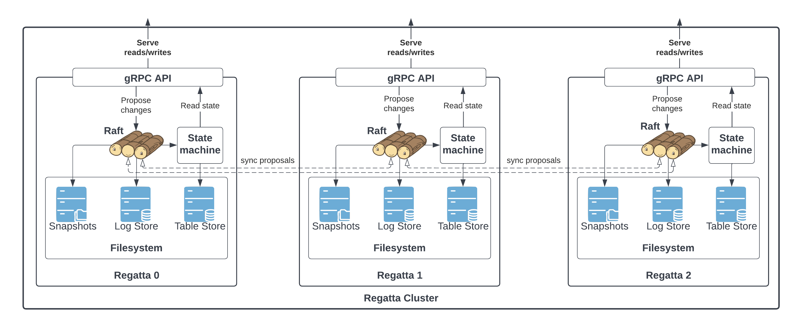

# Architecture

Armada is designed as a "geographically distributed [etcd](https://etcd.io)", providing etcd-like gRPC API in every location
while maintaining a consistent data set. See [API](api.md) for the complete documentation of the gRPC API.

## Topology

The Armada is designed as a
[hub-and-spoke](https://en.wikipedia.org/wiki/Spoke–hub_distribution_paradigm),
[consistent core system](https://martinfowler.com/articles/patterns-of-distributed-systems/consistent-core.html).
There is always a single statically defined leader cluster in the topology. Having a statically defined leader cluster
reduces operational costs and greatly simplifies the system due to fewer moving parts.

Armada topology is designed as a multi-group Raft cluster within each data center with asynchronous
pull-based replication across locations. There are two types of clusters within Armada multi-location deployment:
**Armada leader cluster** and **Armada follower cluster**.

* Armada leader refers to a cluster accepting and confirming write proposals, sometimes referred to as a core cluster.
* Armada follower refers to a cluster connected to the leader cluster asynchronously replicating its state locally,
  sometimes referred to as an edge cluster.

Thanks to this topology, the user can dynamically add additional follower clusters.

## Raft

Armada uses [Raft protocol](https://raft.github.io) to ensure consistent data within the boundaries of a single cluster.
Raft is used only for data replication within a cluster. **Data replication from leader to follower clusters is
done via asynchronous polling**. That way Armada can grant high write throughput within the
leader cluster without adding cross-location latency to each request.

The consensus algorithm provides fault-tolerance by allowing the system to operate as long as the majority of members
are available. This is not only useful for disaster scenarios but also enables the easy rolling update of the cluster.

### Raft Library

The `raft/` package is a fork of [dragonboat](https://github.com/lni/dragonboat) by Lei Ni
(copyright 2017-2021 Lei Ni and other contributors, Apache 2.0 licensed). It was forked to give Armada
full control over transport, log storage, snapshots, and configuration, while preserving the battle-tested
multi-group Raft core. The fork diverges from upstream in transport (QUIC-based, replacing the original
TCP transport), snapshot management, and configuration surface. See
[proposal 003](proposals/003-replace-raft-lib.md) for the motivation behind forking rather than keeping
upstream dragonboat as a dependency.

## Tables

Armada supports the notion of tables throughout its API. The tables could be imagined as sort of keyspaces or schemas.
*Each table is its own Raft group replicating within a single location, while also being a single replication unit for
cross-location replication*. That said, all the API guarantees regarding consistency are always scoped to a single table.
There is no guarantee of data consistency within multiple tables.

## Storage

Each table's data is stored in a [Pebble](https://github.com/cockroachdb/pebble) key-value store — a
high-performance LSM-tree-based engine descended from RocksDB. Pebble is used as the state machine
backend for every Raft group.

### MVCC Versioning

Armada assigns a monotonically increasing **revision** to every write. This revision is embedded in
the storage key alongside the user key, providing multi-version concurrency control (MVCC). Each write
increments the revision and older versions are retained until compaction.

### Local Index vs. Leader Index

Each cluster maintains two distinct sequence numbers for every table:

* **Local Raft index** — the index of the Raft log entry as applied in *this* cluster's Raft group.
* **Source leader index** — the Raft log index on the *leader* cluster that produced the logical write.

In a follower cluster the leader index is replicated alongside the command and stored in the Pebble state machine.
This ensures that the same logical write always carries the same MVCC revision across all regions, even though
the local Raft indices differ. As a result, a follower may return a slightly older MVCC revision than the leader
for recently written data, but reads that observe revision *N* on the leader will observe the same data at
revision *N* on any follower that has caught up to that point.

## APIs

Armada exposes several gRPC APIs and a REST API:

* [Armada gRPC API](api.md/#regatta-proto) is the user-facing API handling all read and write requests.
* [Cluster gRPC API](api.md/#regatta-proto) (`regatta.v1.Cluster`) exposes cluster membership and server
  status, including the current server configuration via `Cluster/Status`.
* [Replication gRPC API](api.md/#replication-proto) is enabled only in the leader cluster and is
  responsible for responding to the asynchronous replication requests from follower clusters. Raft log
  is replicated via this API from the leader cluster to follower clusters.
* [Maintenance gRPC API](api.md/#maintenance-proto) creates backups and restores from them.
* REST API exposes endpoints for [metrics and observability](operations_guide/metrics_and_observability.md).

## Configuration System

Armada is configured via [Viper](https://github.com/spf13/viper), which supports layered configuration:

1. **Configuration files** — searched in `/etc/armada/`, `/config`, `$HOME/.armada/`, and the working
   directory. Supported formats: YAML, TOML, JSON.
2. **Environment variables** — all Viper keys can be set as environment variables (dots replaced with
   underscores, e.g. `RAFT_ADDRESS`).
3. **CLI flags** — Cobra flags bound to Viper keys take the highest precedence.

Sensitive values such as `--maintenance.token` and `--tables.token` are intentionally redacted from
the `Cluster/Status` API response.
