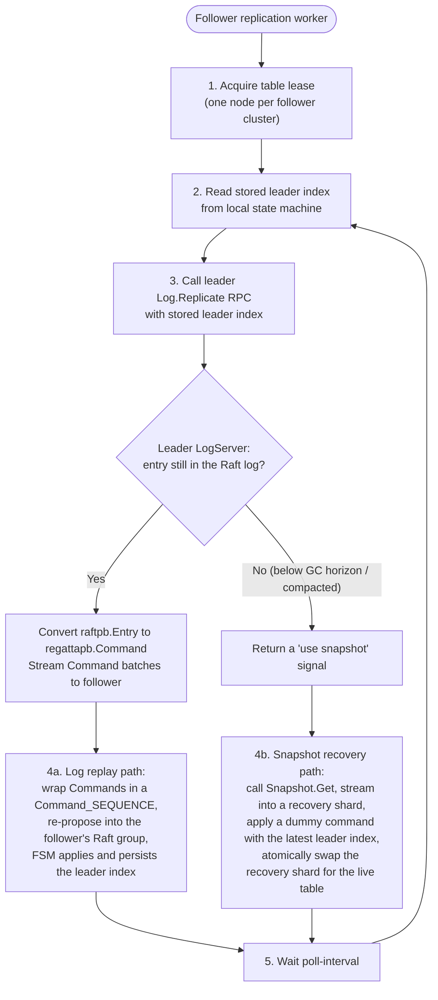
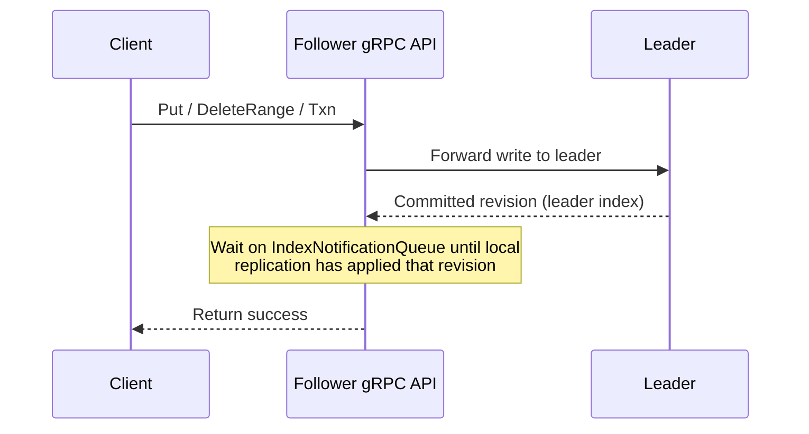

# Cross-Cluster Replication

Armada replicates data from a **leader cluster** to any number of **follower clusters** using
asynchronous, pull-based replication. This page describes how replication works in depth and how to
tune it for your deployment.

See [Architecture](../architecture.md) for a high-level overview of the hub-and-spoke topology.

---

## How Replication Works

### Pull-Based Model

Replication between clusters is **pull-based** — follower clusters periodically poll the leader
rather than the leader pushing to followers. This design choice has important implications:

* Adding a new follower cluster requires **no changes to the leader**.
* Temporary network outages between clusters **do not affect write availability** on the leader.
* Followers replicate at their own pace and can lag behind the leader.
* The leader does not need to track follower progress — each follower tracks its own position.

### Replication Lifecycle

The following describes the full lifecycle of a single replication cycle for one table:



### Logical Command Replication

Cross-cluster replication operates at the level of **logical commands**, not raw Raft log bytes.
The leader's `Log.Replicate` RPC converts its internal Raft entries into `regattapb.Command`
values and streams them to the follower. The follower re-proposes these commands into its own
independent Raft group for each table. This means:

* Each cluster maintains its **own independent Raft state** and local Raft indices.
* The follower stores the **source leader index** alongside its local Raft index so that the
  same logical write always carries the same MVCC revision across all regions.
* The follower can be behind the leader without affecting consistency guarantees *within* the follower.
* Clusters in different regions can use different Raft configurations (e.g. different replica counts)
  without affecting replication.

### Snapshot Fallback

If the requested log position is no longer available on the leader (because the Raft log was
compacted or the GC horizon has advanced), the leader signals the follower to perform a
**snapshot recovery** instead of a log replay. 

#### Resilient Snapshot Modes

Snapshot recovery utilizes a robust pipeline built on object storage concepts, completely replacing legacy, non-resumable gRPC streaming. Depending on your configuration, it operates in one of two modes:

* **Proxy through the leader (`--replication.snapshot-source=proxy`):** the follower
  queries the leader over gRPC for the best snapshot, then downloads the payload
  from the leader's HTTP endpoint. The endpoint honours `Range`, so a dropped
  transfer resumes where it left off. Where the blob backend can mint a
  time-limited URL, the leader answers with a `307` redirect to it instead of
  streaming the bytes; the follower follows the redirect and keeps its `Range`
  header, so the transfer moves off the leader without any loss of resumability.
* **Direct shared-store access (`--replication.snapshot-source=direct`):** the
  follower reads the object store itself, removing the leader from the data path
  entirely. It still reaches the leader over HTTP for the on-demand live
  snapshot fallback, which is an endpoint rather than a stored object.

`auto` (the default) picks `direct` when a `--shared-store.backend` is
configured and `proxy` otherwise.

Armada also supports **incremental snapshots**. Rather than downloading the full
multi-gigabyte state, the follower can apply a delta when its current source
index lies in the artefact's `[base, tip)` range. A delta is valid only when its
base is strictly above the MVCC garbage-collection horizon captured from the
same storage view that produced it; below that horizon, compacted versions and
tombstones may be absent. Candidate eligibility is checked before ranking, so
an invalid delta cannot hide another valid delta or full snapshot.

A recovery applies one selected artefact, then resumes normal log replication.
If the leader no longer has the required log history, it requests another
recovery; it is not inferred from snapshot-query metadata alone.

The leader exports a full snapshot for every table it leads on
`--shared-store.full-interval`, and forces one early when the incremental chain
reaches `--shared-store.incr-max-chain`. The table FSM safely rebases an
incremental base that falls at or below its captured GC horizon. Without the
periodic full export a bucket only ever accumulates incrementals, and a
recovering follower has no base to start from.

An artefact is only offered if its tip index is at or above the table's GC
horizon. After loading an artefact the follower sits at its tip and asks to
replicate from tip+1, which the leader refuses at or below the horizon — so
recovering onto an artefact below the horizon leaves the follower unable to
resume, and the recovery is wasted. When nothing qualifies the leader offers
nothing and the follower falls back to an on-demand live snapshot, which is
current by construction.

This check is deliberately the bare minimum. Adding headroom on top of the
horizon looks appealing — the horizon advances asynchronously while a recovery
runs — but it backfires: artefacts are published on log compaction, and
compaction is exactly what advances the horizon, so a freshly published
artefact's tip sits only about `raft.compaction-overhead` above it. Any
meaningful headroom rejects the newest artefact, which is the only useful one,
and every follower silently degrades to a live snapshot — the per-follower
leader load the shared store exists to avoid.

#### Recovery Lifecycle

Recovery is driven by a durable journal in the Raft-replicated metadata store,
so it survives a power loss at any point and resumes rather than restarting:

1. **Negotiate.** Query the leader for the best artefact and pin its identity in
   the journal, so a GC or a newly published snapshot cannot switch the artefact
   mid-flight.
2. **Download.** Fetch into `{raft.state-machine-dir}/snapshots-staging/`,
   resuming from periodically fsynced byte checkpoints, and verify the advertised
   sha256 and size. Both direct and proxy downloads acquire, renew, and release a
   GC lease for the transfer duration; proxy-mode lease requests remain directed
   at the leader even when the artifact GET is redirected to object storage.
3. **Load.** An incremental replays straight into the live shard. A full
   snapshot is loaded into a new single-member *recovery shard* on one node
   only.
4. **Seed.** The other members join the recovery shard as **non-voting
   learners** and receive the state through Raft's own snapshot path — they
   never replay the command stream themselves.
5. **Promote.** Once a learner reports that it has caught up it is promoted to
   voter, one at a time. A learner that has not caught up is never promoted: the
   coordinator starts as the only voter, so an uncaught-up second voter would
   stall the shard.
6. **Swap.** The recovery shard atomically becomes the table's serving shard and
   the old one is retired through the normal cleanup path.

Throughout steps 3–6 the old shard keeps serving stale-but-consistent reads; the
table only starts routing to the new shard at the swap.

The operator-facing `Restore` maintenance RPC uses the same coordinator, so a
restored table is also loaded once and seeded to peers by snapshot.

Snapshot recovery is also used when a brand-new follower cluster is bootstrapped for the first
time (before it has any local state to resume from).

---

## Follower Write Forwarding

A follower cluster does not accept writes directly into its local Raft groups. Instead, the
follower **forwards write requests to the leader** and then waits for the resulting revision to
be applied locally before returning a response to the caller. This ensures that a client
connected to a follower sees its own writes immediately:



This means follower write latency includes the round-trip to the leader **plus** the time for
the follower to replicate that revision. Callers should account for this additional latency
when writing through a follower.

---

## Data Consistency Guarantees

| Property | Guarantee |
|----------|-----------|
| Within a single table on the leader | **Linearizable** — writes are serialized through the leader's Raft group |
| Within a single table on a follower | **Sequential consistency** — all writes are applied in the same order as on the leader |
| Across tables (any cluster) | **No guarantee** — tables are independent Raft groups |
| After a client write through a follower | **Read-your-writes** — the forwarding path waits for the revision to be locally applied |
| MVCC revisions across clusters | **Consistent** — the same revision number always refers to the same logical write on every cluster that has caught up to it |

---

## Per-Table Lease-Based Workers

Each follower runs one **replication worker** per table. Workers use a lease mechanism to ensure
that only one node in the follower cluster is actively replicating each table at any time.
The lease interval is controlled by `--replication.lease-interval`.

The worker set is reconciled against the current table list periodically. Tables that are
created on the leader are automatically picked up by the next reconciliation cycle on the
follower. The reconcile interval is controlled by `--replication.reconcile-interval`.

---

## Configuration Reference

### Follower Flags

| Flag | Default | Description |
|------|---------|-------------|
| `--replication.leader-address` | `localhost:8444` | Address of the leader's Replication API |
| `--replication.poll-interval` | `1s` | How often the follower polls the leader for new log entries |
| `--replication.log-rpc-timeout` | `1m` | Timeout for each log replication RPC call |
| `--replication.snapshot-rpc-timeout` | `1h` | Timeout for a full snapshot recovery RPC |
| `--replication.max-recovery-in-flight` | `1` | Maximum number of concurrent snapshot recovery goroutines |
| `--replication.max-recv-message-size-bytes` | `8388608` (8 MiB) | Maximum size of a single replication message the follower will accept |
| `--replication.lease-interval` | `15s` | How often workers renew their table leases |
| `--replication.reconcile-interval` | `30s` | How often the follower reconciles its worker set against the current table list |
| `--replication.snapshot-source` | `auto` | Where snapshot artefacts are fetched from: `auto`, `direct` (follower reads the shared store) or `proxy` (through the leader's HTTP endpoint) |
| `--replication.keepalive-time` | `1m` | How often to send keepalive pings on the replication connection |
| `--replication.keepalive-timeout` | `10s` | How long to wait for a keepalive response before closing the connection |

### Leader Flags

| Flag | Default | Description |
|------|---------|-------------|
| `--replication.address` | `http://0.0.0.0:8444` | Address for the leader's Replication API listener |
| `--replication.enabled` | `true` | Whether the Replication API is enabled |
| `--replication.max-send-message-size-bytes` | `4194304` (4 MiB) | Target maximum size of a single replication message sent by the leader |

---

## Tuning Tips

### Reducing Replication Lag

* Decrease `--replication.poll-interval` (e.g. `200ms`) to poll the leader more aggressively.
  Be mindful of the additional load this places on the leader.
* Increase `--replication.max-recv-message-size-bytes` on the follower and
  `--replication.max-send-message-size-bytes` on the leader to allow larger batches to be
  transferred in a single RPC round-trip.

### Improving Snapshot Throughput

* Configure `--shared-store.backend` on both clusters and run followers with
  `--replication.snapshot-source=direct`. That takes the leader out of the data
  path entirely and lets concurrent recoveries proceed in parallel.
* Lower `--shared-store.incr-max-chain` if recoveries spend too long applying a
  long delta chain; raise it to reduce the leader's full-export I/O.
* Increase `--replication.max-recovery-in-flight` only if you have many tables to recover
  simultaneously and sufficient I/O capacity. The default of `1` is safe for most deployments.

### Unreliable or High-Latency Networks

* Increase `--replication.keepalive-time` and `--replication.keepalive-timeout` to tolerate
  transient network outages without dropping the replication connection prematurely.
* Increase `--replication.log-rpc-timeout` if the network round-trip time between the leader
  and follower is high.
* If the follower frequently falls behind the leader's GC horizon and triggers snapshot
  recovery, consider reducing the leader's compaction / GC frequency.

---

## Verifying Recovery Locally

`hack/recovery-e2e.sh` exercises the whole recovery pipeline against real
clusters on `127.0.0.1`: a three-node leader cluster exporting snapshots to a
filesystem shared store, and a three-node follower cluster recovering from it.
Load is driven with [`ghz`](https://ghz.sh) against the gRPC API when it is
installed (`go install github.com/bojand/ghz/cmd/ghz@latest`), falling back to
`arq` otherwise. Prefer ghz: `arq` spawns a process per transaction, and since
one transaction is one Raft entry, generating the few hundred entries needed to
trigger log compaction costs minutes rather than seconds.

```bash
make test-recovery                  # run every scenario
./hack/recovery-e2e.sh full         # run one scenario
./hack/recovery-e2e.sh list         # list scenario names
./hack/recovery-e2e.sh up           # bring the clusters up and leave them
./hack/recovery-e2e.sh down         # tear down
```

| Scenario | What it asserts |
|---|---|
| `baseline` | tail replication converges the follower onto the leader |
| `full` | full recovery is learner-first: exactly one node loads the artefact, the peers join as non-voting learners, get promoted, and the shard is swapped in |
| `incremental` | a follower inside the delta window applies an `incr` artefact into its **live** shard, leaving its shard id unchanged |
| `powerloss` | `SIGKILL` of the recovery coordinator mid-recovery; it resumes from the journal instead of restarting or abandoning |
| `direct` | `--replication.snapshot-source=direct` reads the bucket itself and never falls back to the HTTP-only live key |

Knobs: `KEYS` (total keys written), `GHZ_CONCURRENCY` (ghz workers),
`INCR_GAP` (entries the follower is pushed behind in the incremental scenario),
`BATCH` (puts per transaction, arq fallback only), `ROOT` (state directory,
default `/tmp/armada-recovery`).

Both procfiles (`hack/Procfile.recovery-{leader,follower}`) deliberately run
with small `raft.snapshot-entries` / `raft.compaction-overhead` and a short
`shared-store.full-interval`, so log compaction and snapshot export happen in
seconds rather than hours. They also run at `--log-level=DEBUG`, because the
recovery phase machine reports seeding progress and skipped exports at debug
level. Logs land in `$ROOT/logs/{leader,follower}.log`.

Two things worth knowing when reading a run:

* A follower can reach the correct key count purely by tailing the leader's log
  when the leader has not compacted yet. That says nothing about recovery having
  worked, so the `full` scenario waits for the shard swap rather than the key
  count.
* `INCREMENTAL` only engages when a delta exists whose base index is at or below
  the follower's index. A base-0 artefact (`incr/0_N`) covers the whole key space
  and is rejected as unsound for a non-empty follower, and a chained artefact
  (`incr/N_M`) only applies to a follower at or past `N`. Without a full snapshot
  anchoring the chain near the follower's index, the follower correctly falls
  back to a full recovery.

## Troubleshooting

### Follower is permanently stuck in snapshot recovery

The most common cause is that the follower's stored leader index has fallen so far behind the
leader that the Raft log entries are no longer available. Check:

1. Whether the follower has been offline for longer than the leader's Raft log retention window.
2. Whether `--replication.snapshot-rpc-timeout` is long enough for the snapshot transfer to
   complete (large datasets may require several hours).
3. Network bandwidth — low bandwidth combined with large snapshots can cause the RPC to time out
   before the snapshot is fully received.

### Replication lag is growing continuously

1. Check whether the replication worker has acquired a lease for the affected table. A worker
   that cannot acquire a lease will not replicate. Inspect the `armada_replication_leased` metric.
2. Check the leader's `armada_replication_index` metric versus the follower's applied leader
   index to quantify the lag.
3. Verify that the network path between the follower and leader's Replication API port (default
   `8444`) is open and not rate-limited.

### Follower writes are slow

Write forwarding latency = network RTT to leader + leader commit time + follower replication
catch-up time. To reduce it:

* Place follower clusters geographically close to the leader cluster.
* Reduce `--replication.poll-interval` on the follower so it applies the forwarded revision
  sooner.

---

## Monitoring Replication

See [Metrics and Observability](metrics_and_observability.md) for the Prometheus metrics
exposed by the replication subsystem, including `armada_replication_index` (per-table
leader index observed by the follower) and `armada_replication_leased` (lease status per table).
